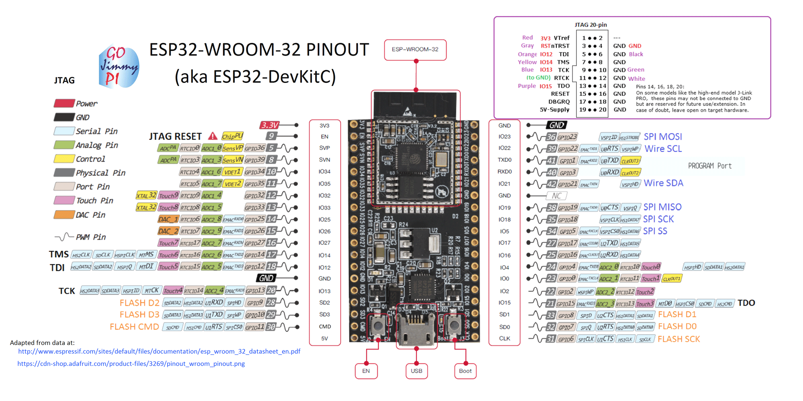
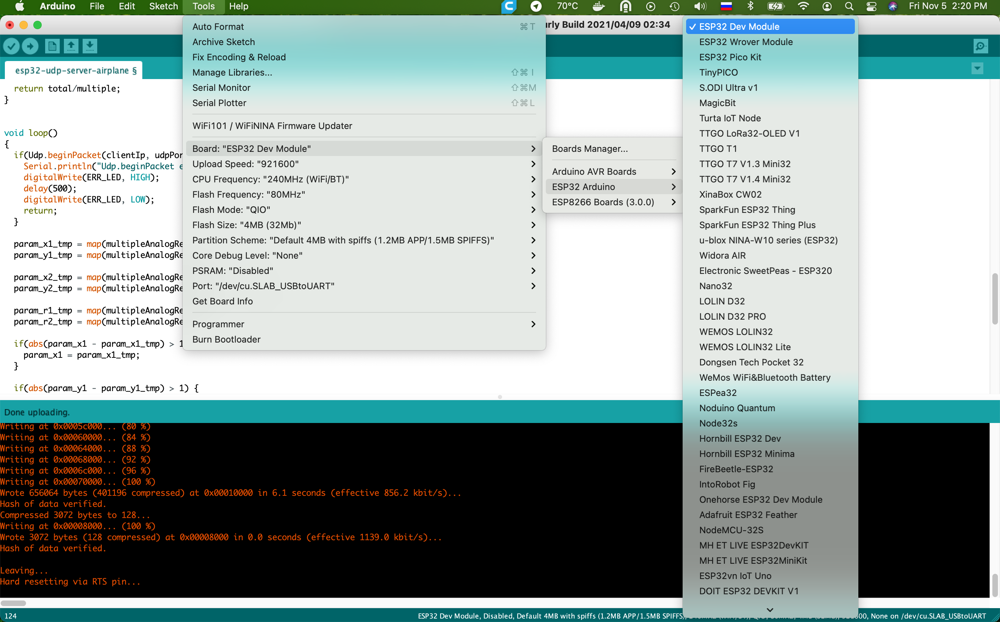

# ESP 32 DevKit

### Pinout


### IDE

### ADC
https://github.com/espressif/arduino-esp32/issues/102

In WIFI mode ADC1 works and ADC2 doesn't work 

To measure ADC correctly we must install 0.1 mkF capacitor and make 64 read cycles
https://docs.espressif.com/projects/esp-idf/en/latest/esp32/api-reference/peripherals/adc.html?highlight=capacitor

### Onboard led
Embedded diodes
```cpp
define PIN2 2

pinMode(PIN2, OUTPUT);
digitalWrite(PIN2, LOW); //включить
```

### WIFI
https://github.com/espressif/arduino-esp32/tree/master/libraries/WiFi/examples
