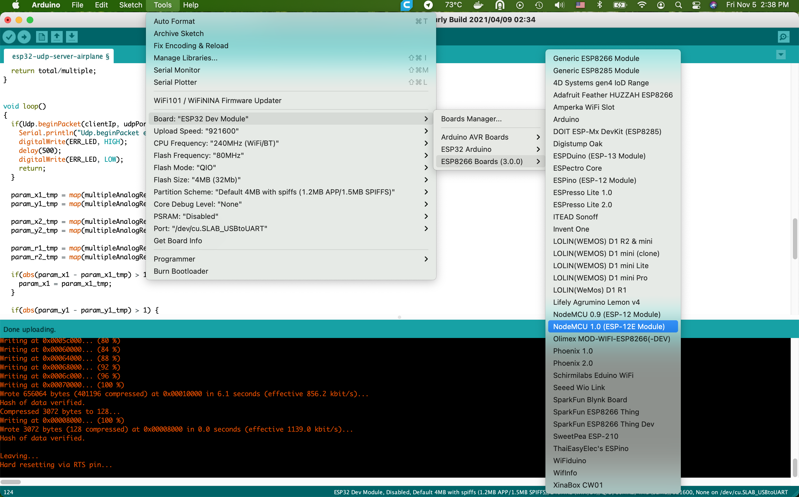

# ESP 8266 NodeMCU

### Pinout


### IDE



### Onboard led
Embedded diodes
```cpp
define PIN1 16
define PIN2 2

pinMode(PIN1, OUTPUT);
pinMode(PIN2, OUTPUT);
digitalWrite(PIN1, LOW); //включить
digitalWrite(PIN2, LOW); //включить
```


